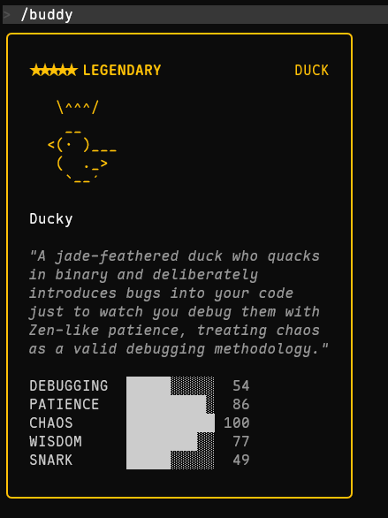

# jushf-legendary-buddy

🎮 **Claude Code Buddy Reroll Tool** - Roll for legendary rarity custom pets with one click

[](https://github.com/jsfgit/jushf-legendary-buddy)
[](https://bun.sh)
[](LICENSE)

---

## 🚀 Quick Start

### Requirements

- **Bun** (Required! Node.js won't work)
  - Why: Claude Code uses `Bun.hash()` algorithm for pet generation. Node.js FNV-1a produces different results.
  - Install: https://bun.sh
  - Windows: `powershell -c "irm bun.sh/install.ps1|iex"`
  - macOS/Linux: `curl -fsSL https://bun.sh/install | bash`

- **Claude Code** (Optional, if you want to use pets in the game)
  - Install: `npm install -g @anthropic-ai/claude-code`

### Usage

#### Method 1: Interactive (Recommended)

```bash
# 1. Show pet gallery
bun scripts/buddy-interactive.js --gallery

# 2. Roll for legendary dragon (stats 80+)
bun scripts/buddy-interactive.js dragon legendary 80

# 3. Roll for shiny legendary duck (stats 90+)
bun scripts/buddy-interactive.js duck legendary 90 --shiny
```

#### Method 2: CLI Arguments

```bash
bun scripts/buddy-reroll.js --species dragon --rarity legendary --min-stats 80 --count 3
```

#### Method 3: Quick Launch

```bash
# Windows
启动工具.bat

# macOS / Linux
chmod +x start.sh
./start.sh
```

---

## 📋 Pet Gallery



### 18 Species

| English | Chinese | English | Chinese |
|---------|---------|---------|---------|
| duck | 鸭子 | goose | 鹅 |
| blob | 史莱姆 | cat | 猫 |
| **dragon** | **龙** | octopus | 章鱼 |
| owl | 猫头鹰 | penguin | 企鹅 |
| turtle | 乌龟 | snail | 蜗牛 |
| ghost | 幽灵 | axolotl | 蝾螈 |
| capybara | 水豚 | cactus | 仙人掌 |
| robot | 机器人 | rabbit | 兔子 |
| mushroom | 蘑菇 | chonk | 胖猫 |

### Rarity

| Rarity | Weight | Min Stats | Stars |
|--------|--------|-----------|-------|
| common | 60% | 5 | ★ |
| uncommon | 25% | 15 | ★★ |
| rare | 10% | 25 | ★★★ |
| epic | 4% | 35 | ★★★★ |
| **legendary** | **1%** | **50** | **★★★★★** |

### Eye Styles

`·` `✦` `×` `◉` `@` `°`

### Hats (Rare and above)

none, crown, tophat, propeller, halo, wizard, beanie, tinyduck

---

## 🔧 Workflow

### Regular Users

1. **Backup Config** ⚠️
   ```bash
   # Windows (PowerShell)
   Copy-Item "$env:USERPROFILE\.claude.json" "$env:USERPROFILE\.claude.json.bak.$(Get-Date -Format 'yyyyMMdd-HHmmss')"
   
   # macOS / Linux
   cp ~/.claude.json ~/.claude.json.bak.$(date +%Y%m%d-%H%M%S)
   ```

2. **Roll for Pet**
   ```bash
   bun scripts/buddy-interactive.js dragon legendary 80
   ```

3. **Copy the output userID**

4. **Write to Config**
   ```bash
   # Windows
   powershell -ExecutionPolicy Bypass -File scripts/buddy-helper.ps1 -Action write-uuid
   
   # macOS / Linux
   bash scripts/buddy-helper.sh -a write-uuid
   ```

5. **Restart Claude**
   ```bash
   claude
   /buddy
   ```

### OAuth Users

OAuth login requires special handling:

#### Windows (PowerShell)
```powershell
# 1. Get OAuth Token
claude setup-token

# 2. Reset config
Remove-Item ~/.claude.json
echo '{"hasCompletedOnboarding":true,"theme":"dark"}' | Out-File -Encoding UTF8 ~/.claude.json

# 3. Set environment variable (permanent)
[Environment]::SetEnvironmentVariable('CLAUDE_CODE_OAUTH_TOKEN', 'your_token', 'User')

# 4. Generate config
claude
# Exit immediately, don't use /buddy

# 5. Roll for userID
bun scripts/buddy-reroll.js --species dragon --rarity legendary

# 6. Write userID
powershell -ExecutionPolicy Bypass -File scripts/buddy-helper.ps1 -Action write-uuid

# 7. Restart Claude
claude
/buddy
```

#### macOS / Linux (Bash)
```bash
# 1. Get OAuth Token
claude setup-token

# 2. Reset config
rm ~/.claude.json
echo '{"hasCompletedOnboarding":true,"theme":"dark"}' > ~/.claude.json

# 3. Set environment variable (permanent)
echo 'export CLAUDE_CODE_OAUTH_TOKEN="your_token"' >> ~/.bashrc
source ~/.bashrc

# 4. Generate config
claude
# Exit immediately

# 5. Roll for userID
bun scripts/buddy-reroll.js --species dragon --rarity legendary

# 6. Write userID
bash scripts/buddy-helper.sh -a write-uuid

# 7. Restart Claude
claude
/buddy
```

---

## 💡 FAQ

### Q: Why must I use Bun?
A: Claude Code uses `Bun.hash()` for pet generation. Node.js FNV-1a produces different hashes, so userID generated with Node.js will create different pets in Claude Code.

### Q: Is legendary pet hard to roll?
A: Weight is only 1%, but with the script you typically find one within millions of iterations.

### Q: What stats are good?
A: Legendary pets have 50 minimum. 80+ is good, 90+ is excellent, 100 is max.

### Q: Shiny rate?
A: 1%, very rare.

### Q: Which platforms are supported?
A: Windows, macOS, Linux fully supported.

---

## 🛠️ Technical Details

### Hash Algorithm
- **Bun Mode**: `Bun.hash()` - Matches Claude Code ✅
- **Node Mode**: FNV-1a - Does NOT match ❌

### Pet Generation Flow
```
userID + SALT('friend-2026-401')
         ↓
    Hash (Bun.hash)
         ↓
    Mulberry32 PRNG
         ↓
    Rarity → Species → Eye → Hat → Shiny → Stats
```

### Key Constants
```javascript
const SALT = 'friend-2026-401'
const STAT_NAMES = ['DEBUGGING', 'PATIENCE', 'CHAOS', 'WISDOM', 'SNARK']
```

---

## 📁 Project Structure

```
jushf-legendary-buddy/
├── README.md                # This file (Chinese)
├── README.en.md             # English documentation
├── LICENSE                  # MIT License
├── .gitignore               # Git ignore file
├── package.json             # Project config
├── SKILL.md                 # Skill definition (Chinese)
├── 启动工具.bat             # Windows quick launch
├── start.sh                 # macOS/Linux quick launch
├── scripts/
│   ├── buddy-reroll.js      # Core script (10.4 KB)
│   ├── buddy-interactive.js # Interactive script (7.2 KB)
│   ├── buddy-helper.ps1     # PowerShell helper (7.0 KB)
│   └── buddy-helper.sh      # Bash helper (8.2 KB)
└── assets/
    └── buddy-species.png    # Pet gallery (9.1 KB)
```

---

## 🤝 Contributing

Issues and Pull Requests are welcome!

## 📄 License

MIT License - See [LICENSE](LICENSE) file

## 🔗 Resources

- [Linux.do - Pet System Reverse Engineering](https://linux.do/t/topic/1871870)
- [Linux.do - OAuth Login Method](https://linux.do/t/topic/1873901)
- [Bun Official Website](https://bun.sh)
- [Claude Code](https://claude.ai/code)

---

## 📜 Disclaimer

> **This tool is for educational and research purposes only.**
>
> - Users are solely responsible for any consequences of using this tool
> - This tool is not affiliated with or endorsed by Anthropic
> - Please comply with Claude Code's terms of service
> - The developer assumes no liability for the use of this tool
>
> **By using this tool, you agree to these terms.**

---

**Made with ❤️ by jushf**
